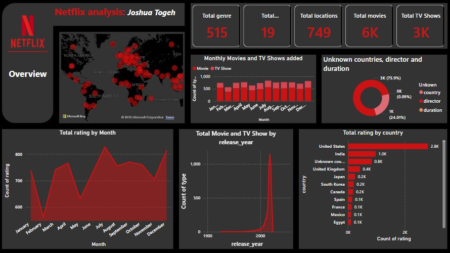

# Data Analyst and Prompt engineer

## Technical Skills

- **Programming Languages:** Python, SQL  
- **Data Analysis & Manipulation:** Pandas, NumPy, SQL, Excel, Power Query  
- **Data Visualization:** Power BI, Matplotlib, Seaborn, Excel  
- **Tools & Platforms:** Jupyter Notebook, Visual Studio Code, Git, GitHub  
- **Database Management:** MySQL, PostgreSQL, SQL Server  
- **Other Tools:** Microsoft Word, Microsoft PowerPoint  
- **Other Skills:** Prompt Engineering, LaTeX, Research Assistance  

## Featured Projects
# Netflix Dashboard using Power BI

## 📊 Project Overview

This interactive Power BI dashboard provides a comprehensive analysis of Netflix content including movies and TV shows. It highlights key metrics like total content, country-wise distribution, release trends, ratings, and metadata gaps.
Access the full project here [Netflix dashboard](https://github.com/Joshua-Togeh/Netflix-dashboard)

# 🧹 Data Cleaning & 📊 Exploratory data Analysis using MySQL
## 📊 Project Overview 
I downloaded the layoff dataset from [Alex The Analyst's GitHub repository](https://github.com/AlexTheAnalyst/MySQL-YouTube-Series/blob/main/layoffs.csv) and performed the following steps:

- **Data Cleaning**:
  - Removed duplicate records to ensure data integrity.
  - Standardized data by trimming white spaces and unifying similar entries (e.g., "Crypto" and "Cryptocurrency" standardized to "Crypto").
  - Corrected inconsistent data types by converting the 'Date' column from text to proper date format.
  - Handled missing and null values by updating or removing them to ensure data completeness.
  - Removed irrelevant columns that were not necessary for the analysis.

- **Exploratory Data Analysis (EDA)**:
  - Conducted EDA on the cleaned dataset to uncover insights and trends related to layoffs across different companies, industries, and time periods.
Access the full project here [Data cleaning and EDA using MySQL](https://github.com/Joshua-Togeh/Data-cleaning-and-EDA-Using-MYSQL)

## Contact
